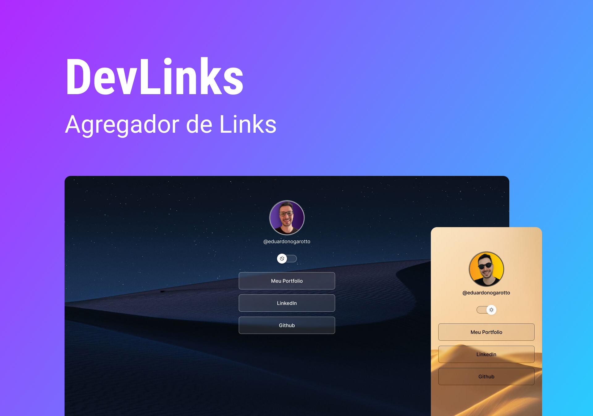

<h1 align="center"> DevLinks - Eduardo Nogarotto</h1>

Agregador de Links criado com base em um curso gratuito promovido pela <b>Rocketseat</b> para ensino de tecnologias WEB (Front-end).  
Aos interessados, segue o link do curso abaixo:  
<a href="https://lp.rocketseat.com.br/devlinks/inscricao?utm_source=github&utm_medium=descricao&utm_campaign=capture-devlinks&utm_term=organic&utm_content=descricao-github-mayk-brito">Se inscreva gratuitamente clicando aqui.</a>

  <a href="#-tecnologias">Tecnologias</a>&nbsp;&nbsp;&nbsp;|&nbsp;&nbsp;&nbsp;
  <a href="#-projeto">Projeto</a>&nbsp;&nbsp;&nbsp;|&nbsp;&nbsp;&nbsp;
  <a href="#-layout">Layout</a>&nbsp;&nbsp;&nbsp;|&nbsp;&nbsp;&nbsp;
  <a href="#memo-licença">Licença</a>

  

 

  

## 🚀 Tecnologias

Esse projeto foi desenvolvido com as seguintes tecnologias:

- HTML
- CSS
- JavaScript
- Git e Github
- Figma

## 💻 Projeto

O DevLinks é um agregador de links para usar como cartão de visitas online.

- [Clique aqui para acessar o meu projeto finalizado.](https://eduardonogarotto.github.io/links)

- [Clique aqui para assistir as aulas e criar o seu próprio projeto (gratuitamente).](https://lp.rocketseat.com.br/devlinks/inscricao?utm_source=github&utm_medium=descricao&utm_campaign=capture-devlinks&utm_term=organic&utm_content=descricao-github-mayk-brito)

## 🔖 Layout

Você pode visualizar o layout original do projeto através [DESSE LINK](https://www.figma.com/community/file/1187422022288947321). É necessário ter conta no [Figma](https://figma.com) para acessá-lo.

## :memo: Licença

Esse projeto está sob a licença MIT.

---

Um agradecimento especial a <b>Rocketseat</b> por todos os projetos educacionais e por estimular o aprendizado em comunidade. 🚀 [Participe da nossa comunidade!](https://discord.gg/rocketseat)
